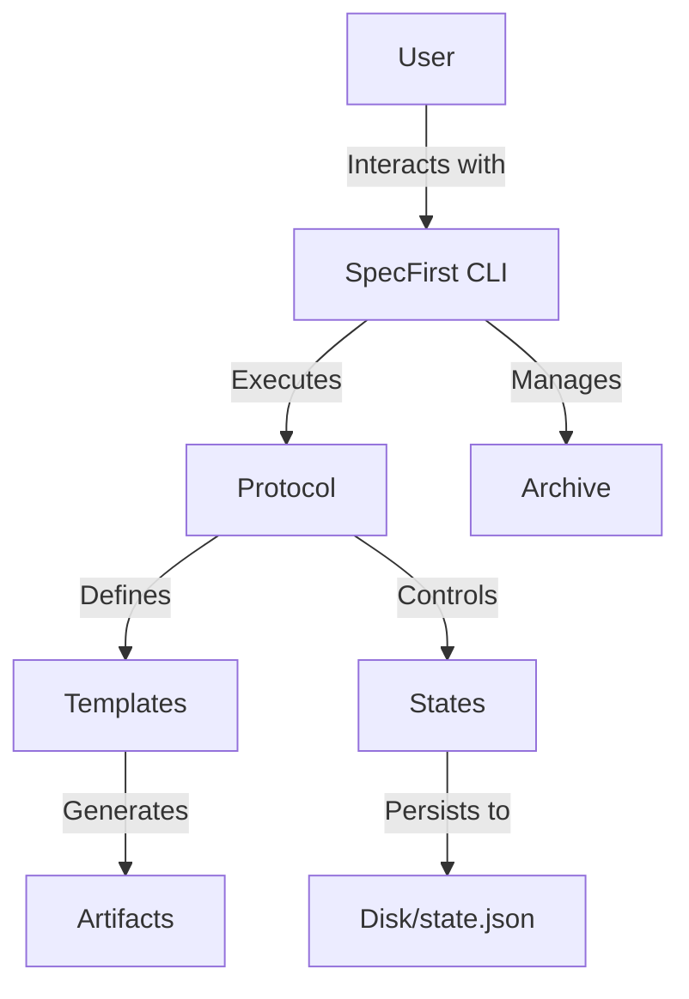

# Architecture & Conceptual Overview

This document explains the mechanics of SpecFirst and how the various "moving parts" interact to create a verifiable engineering workflow.

## System Components

### 1. Protocols
The "heart" of the system. A protocol (`protocol.yaml`) defines a series of **stages** (e.g., Planning, Execution, Verification). It dictates what templates are available and what validations must pass to proceed.

### 2. States & Persistence
*   **Disk State:** The actual files in your workspace (templates, specifications, code).
*   **`state.json`:** A hidden metadata file that tracks which stage you are in, which files have been completed, and who approved them.
*   **Canonical Truth:** The `state.json` is the source of truth for the *workflow engine*, while the disk is the source of truth for the *project content*.

### 3. Archive Philosophy
When you run `spec archive`, the system captures more than just a snapshot of the code. It captures:
1.  **Context:** The specific protocol and versions used.
2.  **Intent:** The filled-out templates (assumptions, calibrations).
3.  **Traceability:** Who approved each stage and when.

**Workspace Debris vs. Tracked Artifacts:**
SpecFirst distinguishes between temporary files (debris) and meaningful records (artifacts). Archives focus on preserving the path taken to reach the result, ensuring that "restoring" an archive brings back the full context of the decision-making process, not just the final bytes.

## Restore Semantics
*   **Restore** means recreating the exact state of a project at a specific point in time.
*   If a file existed in the workspace but not in the archive, it is **removed** upon restoration to ensure a clean, reproducible state.
*   The `state.json` is restored alongside the workspace to allow the user to resume the workflow exactly where it left off.

## Codebase Architecture
The SpecFirst CLI implementation follows a **Layered Architecture** to separate concerns and ensure maintainability:

### 1. Command Layer (`cmd/`)
The entry point for user interaction. Commands are thin wrappers that:
-   Parse CLI flags and arguments.
-   Initialize the `Engine`.
-   Delegate core logic to the `Engine`.
-   Print results (success messages or warnings).

### 2. Application Core (`internal/engine/`)
The heart of the application logic. The `Engine`:
-   Orchestrates the workflow.
-   Manages `State`, `Config`, and `Protocol` loading/saving.
-   Validates transitions and logic (e.g., `Check`, `CompleteStage`).
-   Prevents illegal operations.

### 3. Domain Primitives (`internal/protocol`, `internal/state`, `internal/task`)
Pure data structures and validation logic for the core concepts of SpecFirst. These packages have minimal dependencies.

### 4. Infrastructure & Utilities (`internal/workspace`, `internal/store`, `internal/prompt`, `internal/template`)
Low-level services that handle technical details:
-   **`workspace`**: File system operations, artifact resolution, hashing, and atomic writes.
-   **`store`**: Path management for standard directories (`.specfirst/`).
-   **`template`**: Text processing and rendering.

