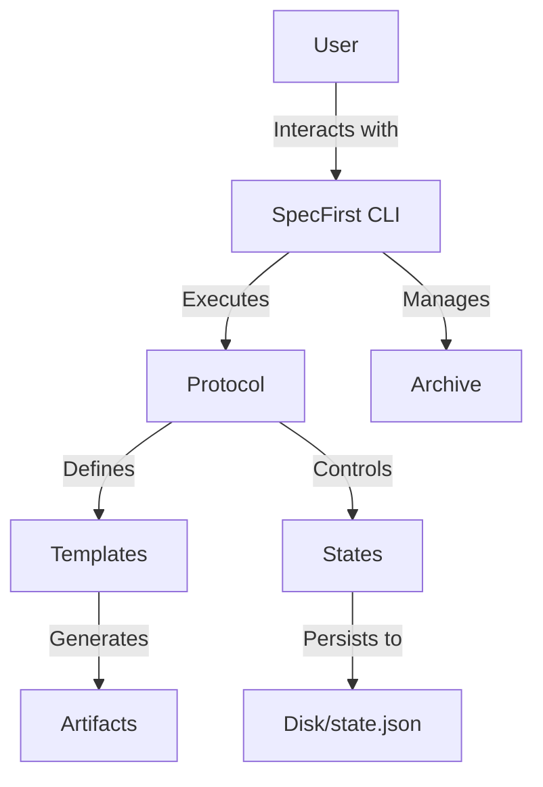
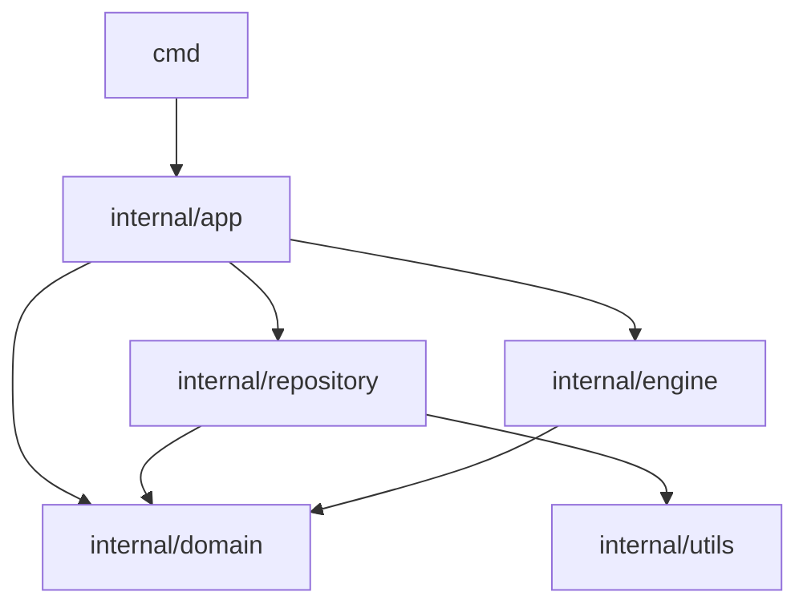

# Architecture & Conceptual Overview

This document explains the mechanics of SpecFirst and how the various "moving parts" interact to create a verifiable engineering workflow.

## System Components



### 1. Protocols
The "heart" of the system. A protocol (`protocol.yaml`) defines a series of **stages** (e.g., Planning, Execution, Verification). It dictates what templates are available and what validations must pass to proceed.

### 2. States & Persistence
*   **Disk State:** The actual files in your workspace (templates, specifications, code).
*   **`state.json`:** A hidden metadata file that tracks which stage you are in, which files have been completed, and who approved them.
*   **Canonical Truth:** The `state.json` is the source of truth for the *workflow engine*, while the disk is the source of truth for the *project content*.

### 3. Archive Philosophy
When you run `specfirst archive`, the system captures more than just a snapshot of the code. It captures:
1.  **Context:** The specific protocol and versions used.
2.  **Intent:** The filled-out templates (assumptions, calibrations).
3.  **Traceability:** Who approved each stage and when.

**Workspace Debris vs. Tracked Artifacts:**
SpecFirst distinguishes between temporary files (debris) and meaningful records (artifacts). Archives focus on preserving the path taken to reach the result, ensuring that "restoring" an archive brings back the full context of the decision-making process, not just the final bytes.

**Tracks (Parallel Futures):**
Tracks extend the archive philosophy to support branching futures. A "track" is simply a named snapshot that lives in `.specfirst/tracks` instead of `.specfirst/archives`. Tracks allow you to save your current state, experiment in a different direction, and then `restore` (switch) between them.

## Restore Semantics
*   **Restore** means recreating the exact state of a project at a specific point in time.
*   If a file existed in the workspace but not in the archive, it is **removed** upon restoration to ensure a clean, reproducible state.
*   The `state.json` is restored alongside the workspace to allow the user to resume the workflow exactly where it left off.

## Codebase Architecture
The SpecFirst CLI implementation follows a **Clean Layered Architecture** to separate concerns, enforce dependencies, and ensure maintainability:



### 1. Presentation Layer (`cmd/`)
The entry point for user interaction. Commands are thin wrappers that:
-   Parse CLI flags and arguments.
-   Initialize the `Application` coordinator via `app.Load()`.
-   Delegate use-case execution to `internal/app`.
-   Print results (success messages or warnings).

### 2. Application Layer (`internal/app/`)
The **Coordinator**. This layer implements the primary use cases and workflows of the system.
-   **Orchestration**: Manages the flow data between repositories, engine, and domain logic.
-   **Use Cases**: `InitializeWorkspace`, `CompleteStage`, `CompilePrompt`, `Check`, `AttestStage`.
-   It does **not** contain low-level I/O logic (Repository) or core business rules independent of workflow (Domain).

**Key Files:**
-   `app.go` - `Application` struct holding references to state and config.
-   `complete.go`, `init.go`, `task.go` - Specific workflow implementations.

### 3. Domain Layer (`internal/domain/`)
The **Core**. Pure business logic and entities. This layer has **zero external dependencies** (except stdlib).
-   **Entities**: `Protocol`, `Stage`, `Task`, `State`, `Config`.
-   **Logic**: State transitions, validation rules, task parsing.

**Key Files:**
-   `protocol.go`, `state.go`, `task.go`, `config.go`.

### 4. Repository Layer (`internal/repository/`)
The **Persistence & I/O** layer. Handles all interactions with the filesystem and storage.
-   **Persistence**: Loading/Saving `State`, `Config`, `Protocol`.
-   **Artifacts**: Managing `.specfirst/` directory structure, resolving paths.
-   **Snapshots**: Archives and Tracks logic.

**Key Files:**
-   `state_repo.go`, `config_repo.go`, `protocol_repo.go`.
-   `snapshot_repo.go`.

### 5. Engine Layer (`internal/engine/`)
The **Mechanics**. Specialized subsystems for processing text and prompts.
-   **Templating**: Processing `text/template` files (`templating/`).
-   **Prompts**: Schema validation, ambiguity detection, and formatting (`prompt/`).
-   **System**: Loading embedded system prompts (`system/`).

## Dependency Graph

```
cmd/
 └── internal/app/             ← Orchestration
      ├── internal/domain/     ← Entities
      ├── internal/repository/ ← I/O & Persistence
      └── internal/engine/     ← Mechanics
```

This hierarchy is strictly enforced. `domain` never imports `app` or `repository`. `repository` never imports `app`.

## Recent Refactoring (Jan 2026)

- **Layered Architecture**: Migrated from a flat/mixed `internal` structure to strict layers (`app`, `domain`, `repository`, `engine`).
- **`internal/workspace` Dissolved**: Functionalities moved to `internal/repository` (paths) and `internal/utils` (fs/hashing).
- **`internal/store` Removed**: Merged into `internal/repository`.
- **`cmd` Thinning**: All logic moved to `internal/app`, leaving `cmd` as a pure interface layer.
